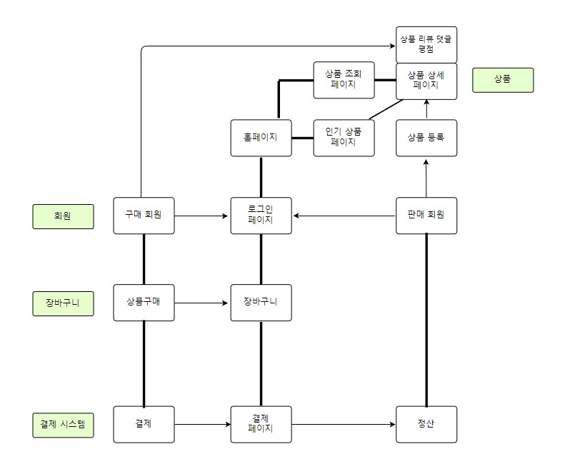

# Gakko Mall

## Skills

### Backend

#### Build tool

- Gradle

#### Spring Boot Dependencies

- JAVA 11
- Spring MVC
- Spring Boot Security
- Spring Data JPA
- Lombok
- OAuth2
- MySQL Driver

#### Database

- MySQL


<br/>

### Frontend

- Javascript
- TypeScript
- React

<br/>

#### Construct Project

```
npx create-react-app frontend --template=typescript
cd frontend
npm start
```

<br/>

#### Installation

- react-router-dom
- react-bootstrap
- styled-components

```
npm install react-router-dom @types/react-router-dom
yarn add redux react-redux
npm i react-bootstrap bootstrap
npm i @types/bootstrap
```

<br/>

<hr/>

## Feature

- `GitMind`를 이용해 구성



<br/>

<hr/>
